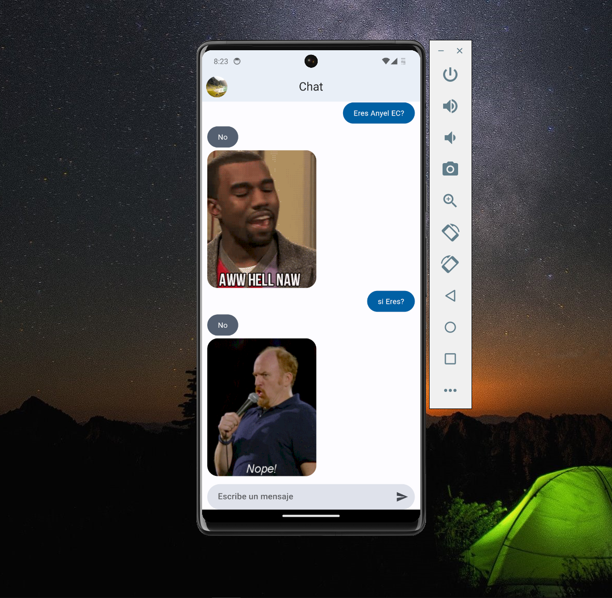
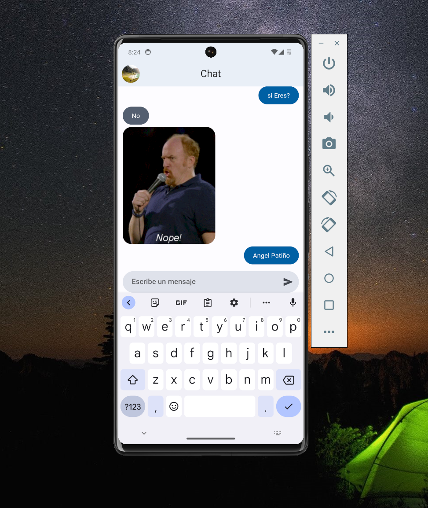

# Chat App by Flutter (API Yes or No)

This is a Flutter application for a chat app that consumes an API to provide Yes or No answers. The chat interface allows users to send messages and receive responses based on the Yes or No API.

## **Select Language: 🌐**
- [Español (Spanish)](README.md)
- [English](README-en.md)

## Results
### Home Chat, answer

### Home Chat, No answer


## Features

- Users can send messages.
- The application consumes an API to get Yes or No responses.
- Responses are provided based on whether the message ends with a question mark.

## Installation

1. Clone the repository:

   ```bash
   git clone https://github.com/Anyel-ec/Flutter-Chat-App
   ```

2. Navigate to the project directory:

   ```bash
   cd chat_app
   ```

3. Install dependencies:

   ```bash
   flutter pub get
   ```

4. Run the application:

   ```bash
   flutter run
   ```

## Usage

1. Launch the application.
2. Enter a message in the chat field.
3. If the message ends with a question mark, the application will send the message and await a Yes or No response from the API.
4. Receive responses from the chat bot.

## Dependencies

- [provider](https://pub.dev/packages/provider): State management.
- [dio](https://pub.dev/packages/dio): HTTP client for making API requests.

## API Information

The application consumes the following API:

- **Endpoint:** `https://yesno.wtf/api`
- **Method:** GET
- **Response Format:**

```json
{
  "answer": "yes",
  "forced": false,
  "image": "https://yesno.wtf/assets/yes/2.gif"
}
```

## Code Structure

- `main.dart`: Entry point of the application.
- `app_theme.dart`: Configuration for the application theme.
- `chat_screen.dart`: Main screen for the chat interface.
- `chat_provider.dart`: Provider for managing chat-related state.
- `message_field_box.dart`: Widget for the message input field.
- `get_yes_no_answer.dart`: Class for making API requests to get Yes or No answers.
- `yes_no_model.dart`: Model class for parsing API response and converting it to a Message entity.

## Contributing

Contributions are welcome! Please feel free to open issues or submit pull requests.

## License

This project is licensed under the MIT License - see the [LICENSE](LICENSE) file for details.
